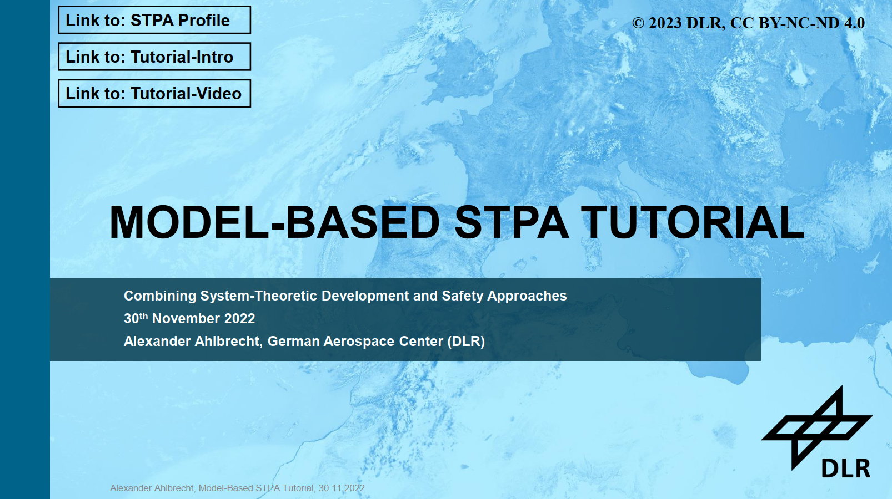
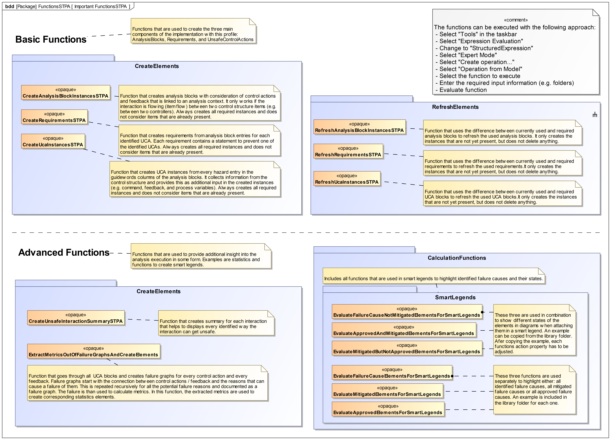

# ModelBasedSTPA

The **System-Theoretic Profile Analysis (STPA)** is a safety analysis approach that targets to identify 
not only component failures but also issues related to inadequate specifications and interactions. 
To be able to use the STPA in combination with SysML, a profile was created (Cameo Systems Modeler version 19 SP3).

The profile itself can be accessed in the Profile/19SP3 folder.
In the folder, one version with and one version without a corresponding example is included.
To use the profile for own projects, it is recommended to import the version without the example.
The structure of the example is shown below.

All important resources for using the profile will be linked below.
It is recommended to take a look at the [**intro**](https://youtu.be/jCtOcbAkEVI) and [**tutorial**](https://youtu.be/hQOw4MYubq0) video to get a better understanding of the background and application.

--------------------------------------------------------------------------------------------------

**Intro**

The [**intro video**](https://youtu.be/jCtOcbAkEVI) serves as an initial statement of the idea of the profile and introduces the tutorial contents.

--------------------------------------------------------------------------------------------------

**Tutorial**

For the usage of the STPA profile, a [**tutorial video**](https://youtu.be/hQOw4MYubq0) was created that explains:
 - Why it could be interesting
 - What is included in the profile
 - How a basic application would look like
 - How advanced concepts can be used
 - What the limitations are
 - What future work will target
 
 In addition, the tutorial slides are placed for download in the Tutorial folder.

--------------------------------------------------------------------------------------------------

**Further Information**

The profile was created with the Cameo Systems Modeler version 19.0 SP3

This means that no guarantee is provided that the profile works with other versions.

However, a quick check for Cameo Systems Modeler version 2022 was executed and the updated profile uploaded in the Profile/2022x folder. This 2022x version has to be viewed with caution, since it was only tested very briefly.

Moreover, the profile is a proof-of-concept implementation and not a qualified product!

Since automated functions are an important parts of the profile, a summary of the most important functions is provided in the Profile folder.

--------------------------------------------------------------------------------------------------

**Related Material**

Recommended STPA Literature:
- [MIT Partnership for Systems Approaches to Safety and Security (PSASS)](http://psas.scripts.mit.edu/home/materials/)
- [STPA Handbook 2018](http://psas.scripts.mit.edu/home/get_file.php?name=STPA_handbook.pdf)
- [Engineering A Safer World](https://direct.mit.edu/books/book/2908/Engineering-a-Safer-WorldSystems-Thinking-Applied)
- [SAE J3187 STPA Guidance](https://www.sae.org/standards/content/j3187_202202/)
- [Podcasts about STPA](https://safetycorner.wagnerflorian.eu/index.php/en/)

Related References from Alexander Ahlbrecht:
- [Master's Thesis - German](https://www.researchgate.net/publication/354599682_Erweiterung_von_MBSE_Prozessen_bei_der_Entwicklung_sicherheitskritischer_Systemarchitekturen_durch_die_Nutzung_Formaler_Methoden)
- [Integrating Safety into MBSE Processes with Formal Methods](https://ieeexplore.ieee.org/document/9594315)
- [Evaluating System Architecture Safety in Early Phases of Development with MBSE and STPA](https://ieeexplore.ieee.org/document/9582542)
- [Model-Based STPA: Enabling Safety Analysis Coverage Assessment with Formalization](https://ieeexplore.ieee.org/document/9925883)
- [Model-Based STPA: Towards Agile Safety-Guided Design with Formalization](https://ieeexplore.ieee.org/abstract/document/10005396)

--------------------------------------------------------------------------------------------------

**Licensing Information**

The STPAStandaloneProfile*.mdzip and STPAStandaloneProfileWithExample*.mdzip (*version) are licensed under the MIT license.

The corresponding introductory resources are licensed under the [CC By-NC-ND 4.0](https://creativecommons.org/licenses/by-nc-nd/4.0/) license. 
The introductory resources inlcude:
- [Introduction-Video](https://youtu.be/jCtOcbAkEVI)
- [Tutorial-Video](https://youtu.be/hQOw4MYubq0)
- Tutorial-Slides: Tutorial/STPA_Tutorial_Slides.pdf

For both, the profile and the introductory resources, the copyright belongs to the German Aerospace Center / Deutsches Zentrum für Luft- und Raumfahrt e.V. (DLR): 

Copyright (c) 2023 Deutsches Zentrum für Luft- und Raumfahrt e.V. (DLR)

--------------------------------------------------------------------------------------------------

**Contact Information**

The profile was created by Alexander Ahlbrecht.
- [LinkedIn](https://www.linkedin.com/in/alexander-ahlbrecht-411907225/)
- [ResearchGate](https://www.researchgate.net/profile/Alexander-Ahlbrecht)
- [GoogleScholar](https://scholar.google.com/citations?user=XildzN5o6jAC&hl=de&oi=ao)

In case of questions, you can also write a mail to: alexander.ahlbrecht@dlr.de
